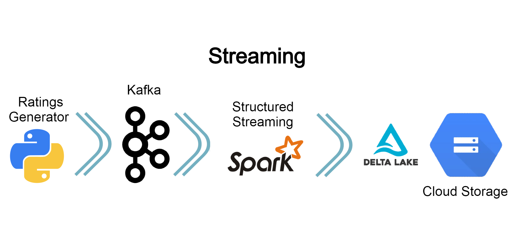
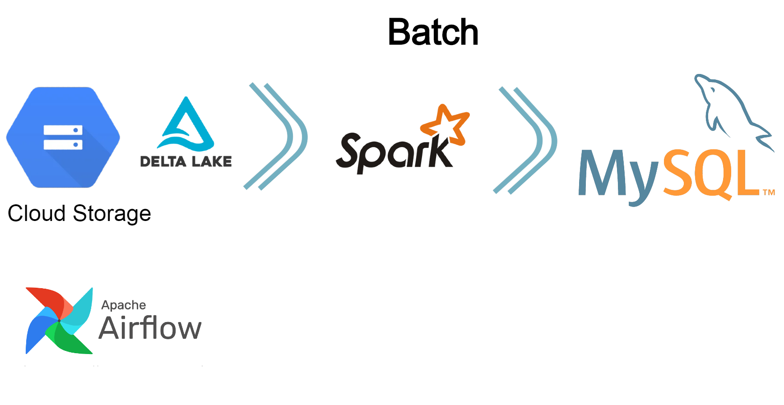

# MovieRatings

Pipeline de dados utilizando o dataset disponibilizado pela GroupLens: https://grouplens.org/datasets/movielens/latest/. 

Informações do dataset:
- movie.csv: Dados dos Filmes
- rating.csv: Dados de Avaliação dos Filmes

O projeto foi implementado dentro da Google Cloud Platform com algumas limitações do período gratuito.

Para o providenciamento da infraestrutura no GCP, foi utilizado o Terraform como IaC (Infra as Code).

Estrutura de pastas:
- ./dags -> DAGs do Airflow
- ./commands -> alguns comandos de configuração do GCP e do Kafka
- ./generate-ratings -> projeto python para Geração de Ratings
- ./zeppelin-notebooks -> notebooks do Apache Zeppelin
- ./jobs -> jobs pyspark
- ./terraform -> arquivos do Terraform e scripts de inicialização da VM e clusters
- docker-compose.yml -> docker containers do projeto

Workflow do projeto:
- Geração de novos registros de Rating artificialmente
- Ingestão desses dados no Kafka
- Ingestão no Spark
- Inserção desses dados no Delta Lake
- Diariamente: ETL dos dados do Delta Lake para o MySQL

Produtos GCP utilizados:
- Cloud Dataproc (Apache Spark + Apache Zeppelin)
- Cloud Storage
- Cloud ComputeEngine VM (docker containers: Kafka, Zookeeper, Airflow, MySQL)

Streaming:
- Ratings Generator -> Geração de novos registros de Rating -> Apache Kafka -> Spark -> Delta Lake

Job ETL:
- Selecionar os TOP 1000 filmes com maiores números de Rating
- Depois selecionar os TOP 100 com melhores Rating

Batch:
- Execução do Job diariamente
- Delta Lake -> Spark -> MySQL
- Orquestrador: Apache Airflow

Tech-Stack:
- Terraform: provisionamento da infraestrutura em código
- Apache Spark: framework de processamento
- Apache Airflow: orquestrador dos Batch Jobs
- Apache Kakfa: usado como fila de mensagem de eventos
- GCP Storage: Data Lake
- Delta Lake: camada que provém transações ACID e validação de Schema para o Data Lake
- MySQL para simular um DataWarehouse com o resultado do processamento
- Apache Zeppelin: usado para testes e visualizações

Se tiver interesse em ver o resultado final do projeto, favor enviar email para caiosgon3@gmail.com
